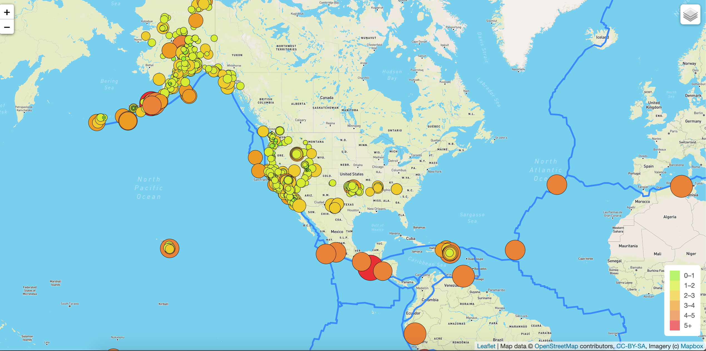
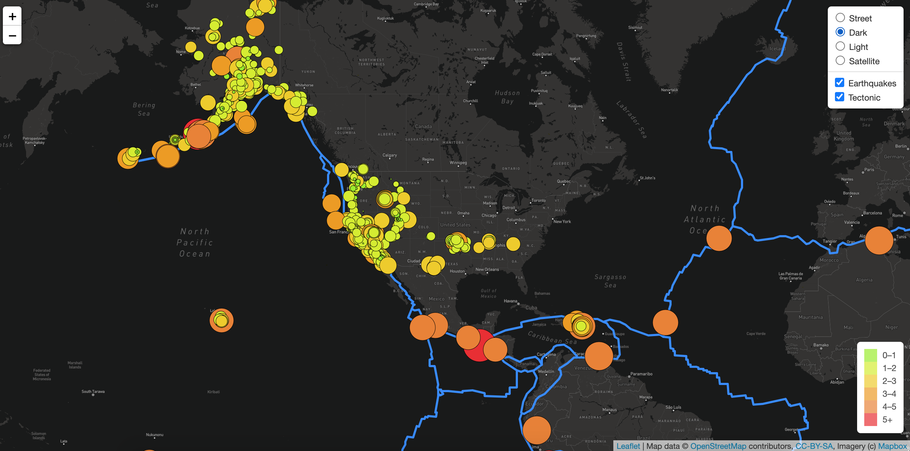
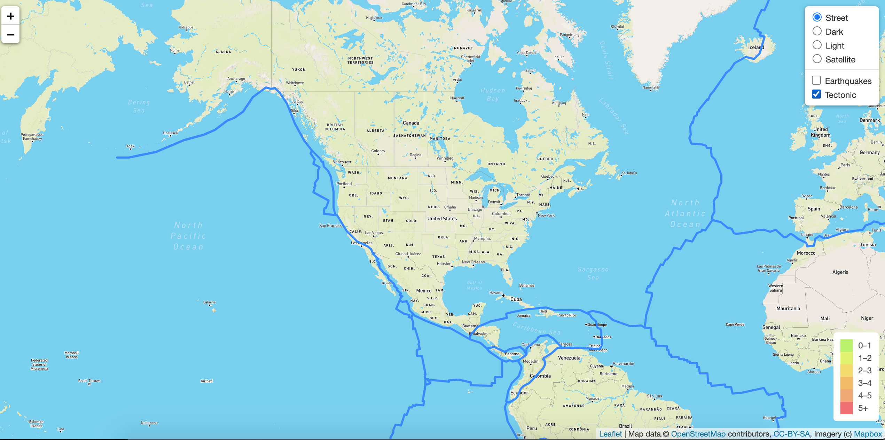
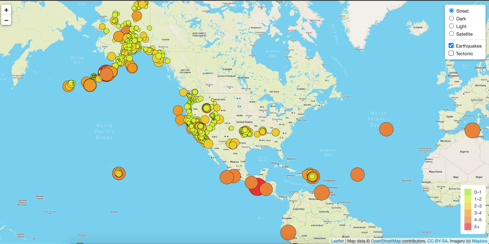

# Mapping Earthquakes

UC Berkeley Extension Data Analytics Boot Camp Module 13

<i>Using Leaflet.js, D3.js, and GeoJSON.</i>

---

## Purpose:

The purpose of this project was to visually show the differences between the magnitudes of earthquakes all over the world for the last seven days, as well as the tectonic plates around the globe.

## Execution:

To complete this project, we used a GeoJSON earthquake data from the USGS website and retrieved geographical coordinates and the magnitudes of earthquakes for the last seven days. We then add the data to a map, including various different map styles. We also allow the user to toggle the earthquake markers or tectonic plate lines on-and-off.

---

## Examples:

When you load the page, it defaults to the Streets view with both the Earthquakes and Tectonic Plate overlays engaged. The legend shows you the color coding for various magnitudes.

You can select one of four different different map styles, such as the Dark theme shown below:

You can also toggle the Earthquakes to show or not-show, as well as the Tectonic Plates.

